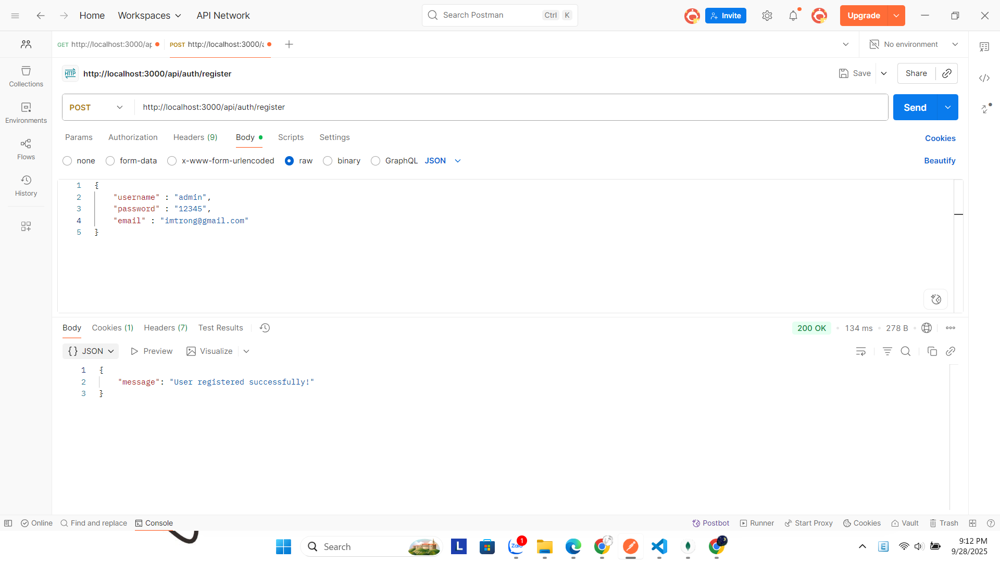
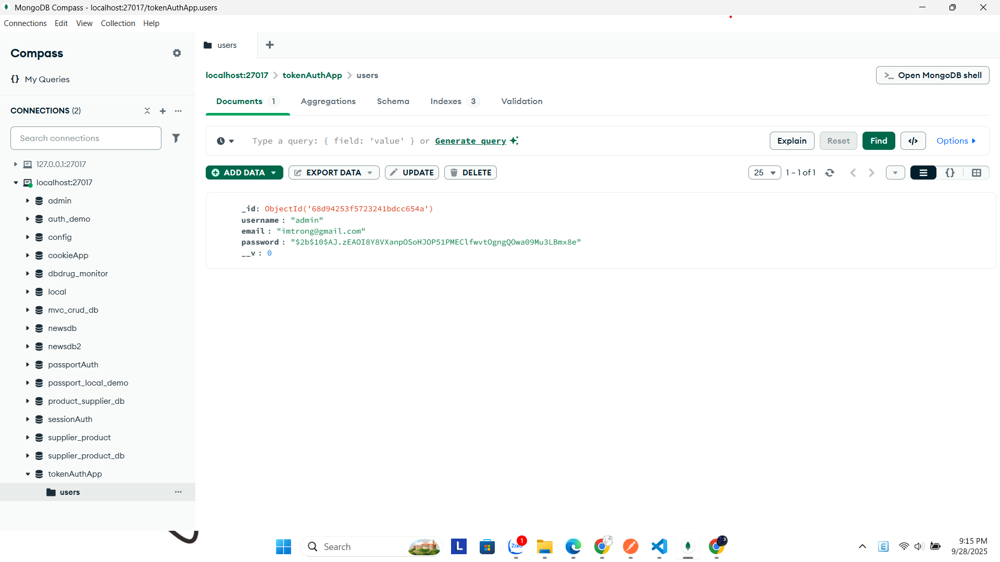
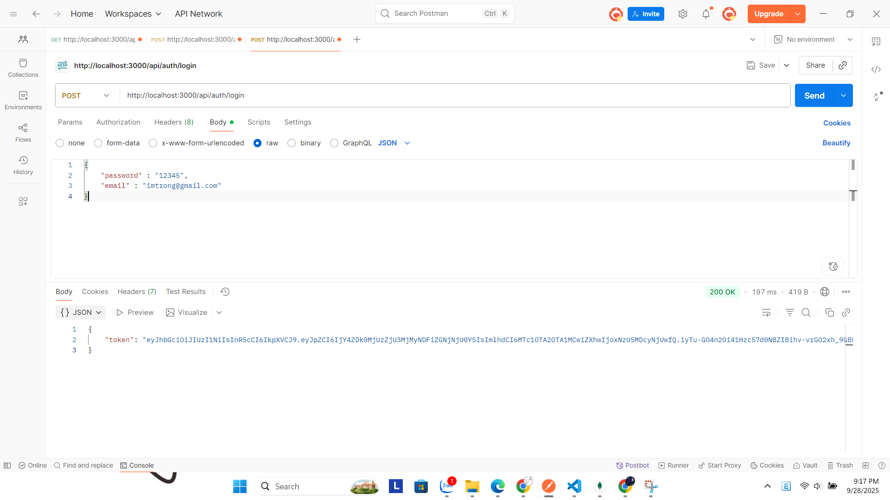
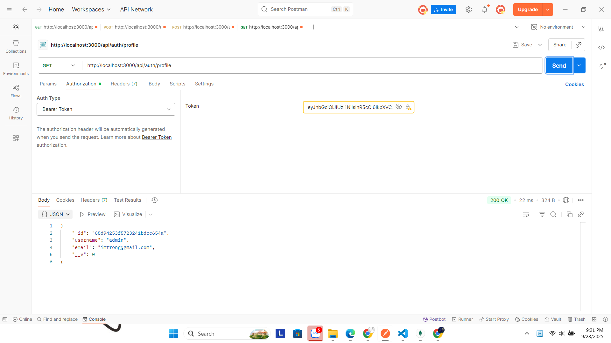
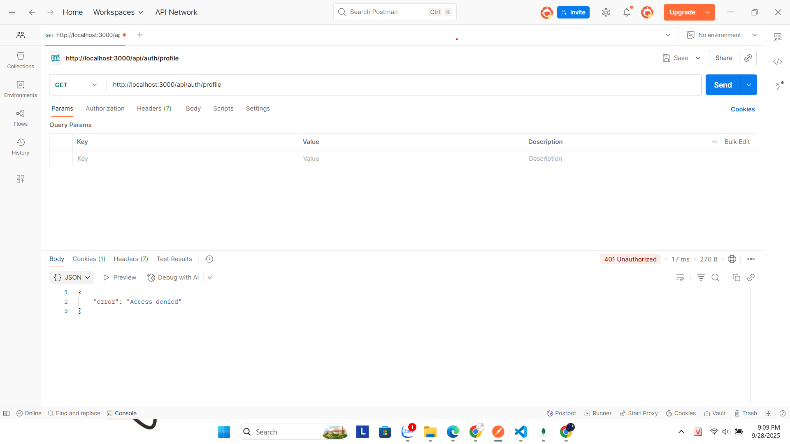

# Token Authentication (JWT)

## Giới thiệu
Dự án này minh họa cách sử dụng **JWT (JSON Web Token)** để xác thực người dùng trong ứng dụng Node.js với Express và MongoDB.

Các chức năng chính:
- Đăng ký người dùng (`/register`)
- Đăng nhập và nhận token (`/login`)
- Truy cập API bảo vệ bằng token (`/profile`)

## Cài đặt

### 1. Clone dự án và cài đặt thư viện
```bash
npm install express bcryptjs jsonwebtoken mongoose body-parser
````

### 2. Chạy server

```bash
node server.js
```

Server mặc định chạy tại:
[http://localhost:3000](http://localhost:3000)

---

## API Endpoints

### 1. Register

**POST** `/register`

Request Body:

```json
{
  "username": "admin",
  "email": "admin@example.com",
  "password": "12345"
}
```

📷 Kết quả trong Postman:



---

### 2. Login

**POST** `/login`

Request Body:

```json
{
  "email": "admin@example.com",
  "password": "12345"
}
```

Response:

```json
{
  "token": "JWT_TOKEN_HERE"
}
```

📷 Kết quả trong Postman:


---

### 3. Profile (Protected)

**GET** `/profile`

Headers:

```
Authorization: Bearer JWT_TOKEN_HERE
```

📷 Khi đã đăng nhập thành công:


📷 Khi không truyền token:


---

## Thư mục hình ảnh

Tất cả hình test API được lưu trong thư mục:

```
public/results/
```

Danh sách ảnh:

* `register.png`
* `show_users_mongodb_register.png`
* `login.png`
* `profile.png`
* `profile_no_login.png`

---

## Kết luận

Dự án này giúp bạn hiểu cách:

* Lưu user vào MongoDB
* Hash mật khẩu với `bcryptjs`
* Tạo và xác thực JWT bằng `jsonwebtoken`
* Bảo vệ API với middleware kiểm tra token
